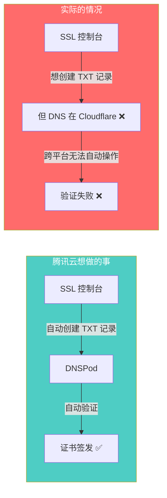
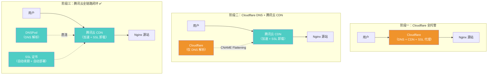

# DNS 基建复盘：为什么免费的 Cloudflare 反而是最贵的选择

> 一个独立开发者在域名基建上踩了半年的坑，从"贪图免费"到"全链路闭环"的认知进化。

---

# 一、背景：一个持续了半年的基建泥潭

## 1.1 问题的本质

亲亲心情笔记的 DNS 基建，从 v1.0 立项到 v2.0 结束，经历了三次架构变迁。表面上看是"换了个 DNS 服务商"，但本质上暴露了独立开发者在做技术选型时的一个典型陷阱：

> **被"免费"吸引，忽略了"免费"背后的隐性成本 —— 而这些隐性成本最终远超一个付费方案的价格。**

## 1.2 时间线概览

| 时间 | 事件 | 当时的心态 |
|------|------|-----------|
| ~2025 (v1.0 初期) | 选择 Cloudflare 做 DNS + CDN + SSL 全家桶 | 😎 "免费方案，完美！" |
| ~2025 (v1.0 中期) | GFW 封锁 Cloudflare 节点，用户频繁白屏 | 😰 "怎么又连不上了？" |
| ~2025 (v1.0 中后期) | 关闭 Cloudflare 代理，切换腾讯云 CDN | 🤔 "先用 Cloudflare 做纯 DNS 吧" |
| 2026-05-19 | SSL 证书续期失败，Cloudflare 拦截验证 | 😤 "受够了，全部迁走！" |
| 2026-05-19 (当天) | DNS 迁回腾讯云 DNSPod，全链路闭环 | 😌 "早该这么做了" |

## 1.3 这篇复盘要回答的问题

1. 当初为什么选 Cloudflare？这个决策错在哪里？
2. 过程中遇到了哪些具体问题？每次是怎么应对的？
3. 最终方案为什么是腾讯云全链路闭环？
4. 从这次折腾中，能提炼出什么决策框架？

---

# 二、决策复盘：当初为什么选 Cloudflare

## 2.1 决策当时的上下文

做出"用 Cloudflare"这个决定时，面临的约束条件是：

| 约束 | 具体情况 |
|------|---------|
| 身份 | 独立开发者，一个人做全栈 |
| 预算 | MVP 阶段，能省则省 |
| 技术背景 | App 开发出身，对 Web 基建（DNS、CDN、SSL）缺乏体系化认知 |
| 域名 | `qinqinmusic.com` 在第三方注册 |
| 服务器 | 腾讯云北京 BGP 节点，已有 Nginx 跑着 |

## 2.2 Cloudflare 当时的吸引力

```
Cloudflare 免费方案 = DNS 解析 + CDN 加速 + SSL 证书 + DDoS 防护
                    = 一个都不用自己操心
                    = 独立开发者的梦中情人
```

对一个 App 开发出身的人来说，"域名指向 Cloudflare → 打开橙色云 → 完事"这种零门槛体验简直是福音。不用懂 DNS 记录类型，不用懂 SSL 证书链，不用懂 CDN 回源配置 —— Cloudflare 全包了。

## 2.3 这个决策错在哪里？

**错不在选了 Cloudflare 本身，而是在没有验证一个关键前提：Cloudflare 的免费 CDN 节点在中国可用吗？**

| 假设 | 现实 |
|------|------|
| Cloudflare CDN 全球加速，中国用户也能受益 | Cloudflare 免费版节点全部在海外，中国用户走国际出口线路 |
| HTTPS 握手通过 Cloudflare 代理，安全又快 | GFW 随机阻断海外 SSL 握手，导致 `ERR_CONNECTION_CLOSED` |
| 免费 = 零成本 | 免费 = 零货币成本，但排障成本、用户流失成本、迁移成本远超付费方案 |

**核心教训**：做技术选型时，"免费"不应该是决定性因素。真正的决策标准是 **"这个方案在我的用户所在的网络环境下能不能稳定工作"**。

## 2.4 如果回到原点，正确的做法是什么？

在确定使用腾讯云服务器的那一刻，就应该问自己：

> "我的用户在中国，我的服务器在中国，那我的 DNS、CDN、SSL 为什么要绕道海外？"

答案很明显：**全链路都应该在中国**。域名解析用 DNSPod（腾讯云），CDN 用腾讯云 CDN，SSL 用腾讯云免费 DV 证书。一开始就这么做，后面所有的坑都不会存在。

---

# 三、问题清单：Cloudflare 在中国踩的每一个坑

## 3.1 🔴 致命问题：GFW 阻断 SSL 握手

**严重度**：致命 | **影响范围**：所有中国用户 | **发现阶段**：v1.0 中期

### 现象
用户打开 `qinqinmusic.com`，浏览器报 `ERR_CONNECTION_CLOSED`，页面白屏。不是偶发，而是高频出现。

### 根因
Cloudflare 免费版的边缘节点全部在海外（最近的可能在香港或日本）。当中国用户访问时：

```
用户浏览器（中国）
  ↓ HTTPS 请求
  ↓ 经过 GFW（中国防火墙）
  ↓ ← GFW 检测到 SSL 握手目标是已知的海外 CDN IP
  ↓ ← 随机执行 TCP RST 或丢包
  ✗ ERR_CONNECTION_CLOSED
```

GFW 对 Cloudflare 的封锁不是"全面封杀"，而是**随机阻断** —— 有时能连上，有时连不上。这种不确定性是最要命的：你无法复现问题，无法给用户一个明确的答复，只能说"再试试"。

### 教训

> **面向中国用户的产品，网络链路中绝对不能有任何环节经过 GFW 不可控的海外出口。**

这不是 Cloudflare 的错。Cloudflare 是一个优秀的全球 CDN，但它的免费版不适合中国市场。它的 China Network 方案（与百度云合作）需要企业资质和独立付费，不是免费版能用的。

## 3.2 🟡 慢性问题：跨平台运维的心智负担

**严重度**：中等 | **影响范围**：开发者自己 | **发现阶段**：v1.0 中后期至 v2.0

### 问题描述
关闭 Cloudflare 代理后，架构变成了"三家管三件事"：

```
域名注册商（第三方）→ 管域名所有权
Cloudflare           → 管 DNS 解析（CNAME Flattening 到腾讯云 CDN）
腾讯云               → 管 CDN 加速 + SSL 证书
```

每次需要修改 DNS 记录、排查解析问题、或者处理 SSL 证书时，需要在**三个平台之间来回切换**。登录 Cloudflare 改一条记录，登录腾讯云看 CDN 配置，再看域名注册商的 NS 指向 —— 三个控制台，三套概念体系。

### 一个具体的排障场景

SSL 证书快过期了，需要续期。流程是：
1. 登录腾讯云 SSL 控制台 → 申请新证书
2. 腾讯云说"请添加一条 TXT 记录到你的 DNS 来验证域名所有权"
3. 登录 Cloudflare → 添加 TXT 记录
4. 等待验证...
5. 验证失败 → 登录 Cloudflare 检查 TXT 记录是否正确
6. 发现 Cloudflare 的 DNS 缓存导致腾讯云检测不到 TXT 记录
7. 手动清除 Cloudflare DNS 缓存，重新等待
8. 反复折腾...

**对比如果全在腾讯云**：
1. 登录腾讯云 SSL 控制台 → 申请新证书
2. 腾讯云自动在 DNSPod 添加 TXT 记录
3. 自动验证通过 → 自动部署到 CDN
4. 全程无需人工干预

### 教训

> **运维的核心原则之一是"减少活动部件"。三个平台管一条链路，不是灵活，是混乱。**

## 3.3 🔴 压垮骆驼的最后一根稻草：SSL 自动续期失败

**严重度**：致命 | **影响范围**：全站 HTTPS | **发现阶段**：2026-05-19

### 现象
腾讯云 SSL 证书即将到期，自动续期流程启动后失败。原因是腾讯云的自动检测系统需要在域名的 DNS 中添加 TXT 记录来验证所有权，但域名的 DNS 权威服务器指向的是 Cloudflare —— 腾讯云无法在 Cloudflare 上自动创建 TXT 记录。

### 架构瓶颈可视化



### 这件事为什么是"最后一根稻草"

之前的问题（GFW 阻断、跨平台运维）虽然痛苦，但至少还能手动处理。SSL 证书续期失败则直接威胁到**网站的可用性** —— 证书过期后，所有用户都会看到浏览器的"不安全"警告，HTTPS 连接直接断裂。

这是一个**会定期复发且无法自动修复**的问题。每次证书到期（90 天一次），都需要手动跨平台操作。对于一个独立开发者来说，这种周期性的运维债务是不可接受的。

---

# 四、三次架构变迁：从全托管到全闭环

## 4.1 全景架构演进图



## 4.2 阶段一：Cloudflare 全托管（v1.0 初期）

```
架构：用户 → Cloudflare（DNS + CDN + SSL 代理） → Nginx 源站
优点：零配置，一键启用
致命缺陷：GFW 阻断，中国用户大面积白屏
存活时间：~数周
```

**决策分析**：这个阶段的错误是**信息不足导致的无效决策**。作为 App 开发者，不了解 GFW 对海外 CDN 的影响，也没有在上线前做过中国用户的可达性测试。

**如果当时做了一件事就能避免**：在正式上线前，用手机 4G 网络（不走 WiFi）访问一次 Cloudflare 代理后的域名，看看是否稳定。

## 4.3 阶段二：Cloudflare 纯 DNS + 腾讯云 CDN（v1.0 中后期 ~ 2026-05-19）

```
架构：用户 → 腾讯云 CDN（加速 + SSL） → Nginx 源站
DNS：Cloudflare（仅做解析，用 CNAME Flattening 指向腾讯云 CDN）
优点：CDN 国内化，GFW 阻断问题解决
存活问题：SSL 证书续期需跨平台手动操作
存活时间：~半年
```

**决策分析**：这是一个**合理但不彻底的过渡方案**。当时的思路是"CDN 换了就行，DNS 在 Cloudflare 也没事，反正只是做解析"。这个判断在短期内是对的 —— DNS 解析本身确实不受 GFW 影响（DNS 查询走 UDP 53 端口，不涉及 SSL 握手）。

但这个方案埋下了一个**延迟引爆的炸弹**：SSL 证书有有效期，到期需要续期，续期需要 DNS 验证。只要 DNS 不在腾讯云，自动续期就永远做不到。

**这个阶段的关键决策点**：当初关闭 Cloudflare 代理时，如果多想一步 ——"既然 CDN 和 SSL 都搬到腾讯云了，DNS 为什么还留在 Cloudflare？" —— 就能省掉后面半年的隐性成本。

### 阶段二的一个技术亮点：CNAME Flattening

值得记录的是，这个阶段用到了 Cloudflare 的一个高级特性 —— **CNAME Flattening**。

DNS 标准规定：根域名（`@`，即 `qinqinmusic.com`）不能设置 CNAME 记录，只能设置 A 记录。但腾讯云 CDN 分配的是一个域名（`xxx.dnsv1.com`），不是 IP 地址。正常情况下，根域名无法 CNAME 到 CDN 域名。

Cloudflare 的 CNAME Flattening 通过在服务端自动将 CNAME 解析为 A 记录返回给客户端，绕过了这个 DNS 标准限制。这在技术上是优雅的，但也增加了一层依赖 —— 一旦离开 Cloudflare，需要确认新的 DNS 服务商是否也支持类似功能（DNSPod 通过自己的隐性 URL 记录或 CNAME 支持解决了这个问题）。

## 4.4 阶段三：腾讯云全链路闭环（2026-05-19 至今）

```
架构：用户 → 腾讯云 CDN（加速 + SSL） → Nginx 源站
DNS：腾讯云 DNSPod（red.dnspod.net / display.dnspod.net）
SSL：TrustAsia (DigiCert) 免费 DV 证书，自动续期 + 自动部署到 CDN
优点：零人工干预，全链路可控
缺点：无（对于当前规模）
```

**迁移操作**（纯控制台操作，无代码变更）：
1. 在域名注册商处将 NS 从 Cloudflare 改为 `red.dnspod.net` / `display.dnspod.net`
2. 在腾讯云 SSL 控制台为 `qinqinmusic.com` 和 `www.qinqinmusic.com` 申请新的免费 DV 证书
3. 开启自动续费 + CDN 节点自动托管部署
4. DNSPod 自动完成 TXT 记录验证

**决策分析**：这是**最终正确的架构**。域名解析、CDN 加速、SSL 证书三个组件全部在同一个云平台内，形成了真正的闭环：

```
域名 → DNSPod（解析）→ CDN（加速 + SSL 卸载）→ Origin（Nginx）
         ↑                    ↑
         └─── SSL 证书（自动验证 + 自动部署）───┘
```

每 90 天的 SSL 证书续期流程变成了：
1. 腾讯云 SSL 控制台自动发起续期
2. 自动在 DNSPod 创建 TXT 验证记录
3. 自动验证通过
4. 自动将新证书部署到 CDN 所有边缘节点
5. 全程零人工干预

---

# 五、Nginx 层面的连锁变更

DNS 架构的变迁不只影响了云端配置，还引发了 Nginx 层面的连锁修改。

## 5.1 `set_real_ip_from` 白名单重写

当 CDN 从 Cloudflare 切换到腾讯云后，CDN 边缘节点的 IP 段完全不同。Nginx 需要知道"哪些 IP 是可信的 CDN 节点"，才能正确提取用户的真实 IP。

```nginx
# ❌ 阶段一：Cloudflare IP 段
set_real_ip_from 173.245.48.0/20;
set_real_ip_from 103.21.244.0/22;
set_real_ip_from 103.22.200.0/22;
# ... 十几个 Cloudflare IP 段

# ✅ 阶段三：腾讯云 CDN IP 段
# 通过 X-Forwarded-For 头提取真实 IP
real_ip_header X-Forwarded-For;
real_ip_recursive on;
```

## 5.2 遗留的 Cloudflare 注释

当前 `nginx.conf` 中仍有两处 Cloudflare 时代的注释残留：

```nginx
keepalive_timeout 75s; # Increased for Cloudflare
# [Critical Fix] CORS Handling for Cloudflare Flexible SSL
```

这些注释不影响功能，但容易误导后续维护者。建议在下次更新 Nginx 配置时顺手清理。

---

# 六、成本对比：免费的代价

## 6.1 货币成本 vs 隐性成本

| 成本类型 | Cloudflare 免费版 | 腾讯云全链路 |
|---------|-----------------|------------|
| DNS 服务 | ¥0 | ¥0（DNSPod 免费版够用） |
| CDN 加速 | ¥0（但中国不可用） | ~¥0-50/月（腾讯云 CDN 有免费额度） |
| SSL 证书 | ¥0 | ¥0（TrustAsia 免费 DV 证书） |
| **排障时间** | **数十小时**（GFW 阻断排查、跨平台折腾） | **~0** |
| **用户流失** | **不可估量**（白屏导致用户离开） | **0** |
| **迁移成本** | **数小时**（学习新平台 + 迁移配置） | **0**（一开始就这么做） |
| **SSL 续期维护** | **每 90 天手动操作一次** | **全自动** |
| **心智负担** | **高**（三个平台来回切换） | **低**（一个控制台搞定） |

## 6.2 隐性成本量化

粗略估算这半年 Cloudflare 带来的隐性成本：

- 🕐 GFW 阻断排查 + Cloudflare 代理关闭 + CDN 切换：**~8 小时**
- 🕐 CNAME Flattening 配置 + DNS 记录调试：**~3 小时**
- 🕐 Nginx `set_real_ip_from` 重写 + 测试：**~2 小时**
- 🕐 SSL 证书续期排障 + 最终 DNS 迁移：**~4 小时**
- 🕐 各种零碎的跨平台来回切换：**~5 小时**

**合计：~22 小时的开发者时间**。对于一个独立开发者来说，这 22 小时可以完成 2-3 个业务功能。

---

# 七、经验教训与决策框架

## 7.1 核心反思

| 反思点 | 教训 |
|-------|------|
| **"免费"是最贵的** | 免费方案的隐性成本（排障时间、迁移成本、用户流失）往往远超付费方案的显性成本。独立开发者的时间是最稀缺的资源 |
| **了解你的用户在哪里** | 面向中国用户的产品，网络链路的每个环节都必须在中国境内可控。这包括 DNS、CDN、SSL，缺一不可 |
| **减少活动部件** | 三个平台管一条链路 = 三倍排障难度 + 三个失败点。能用一个平台搞定的，绝不分散到多个平台 |
| **做彻底，别留尾巴** | 阶段二关闭 Cloudflare 代理时，如果一步到位把 DNS 也迁走，后面半年的折腾全部可以避免。过渡方案的"临时"往往变成"永久" |
| **先验证再上线** | 上线前用目标用户的真实网络环境（手机 4G、不同运营商）测试可达性，10 分钟的测试可以避免数周的排障 |

## 7.2 基建选型决策框架

经过这次教训，总结出独立开发者做基建选型时应该问自己的五个问题：

```
┌─────────────────────────────────────────────────┐
│         独立开发者基建选型五问                      │
├─────────────────────────────────────────────────┤
│                                                 │
│  ① 我的用户在哪里？                               │
│     → 用户在中国 → 全链路必须在中国                 │
│                                                 │
│  ② 这个"免费"方案在我的场景下真的能用吗？            │
│     → 不要看官网宣传，实际测一下                     │
│                                                 │
│  ③ 出了问题，我能在一个控制台内排障吗？              │
│     → 不能 → 重新考虑方案                          │
│                                                 │
│  ④ 这个方案需要周期性的人工维护吗？                  │
│     → 需要 → 能自动化吗？不能 → 换方案              │
│                                                 │
│  ⑤ 如果半年后需要迁移，迁移成本有多大？              │
│     → 选择退出成本低的方案                          │
│                                                 │
└─────────────────────────────────────────────────┘
```

## 7.3 对其他独立开发者的建议

### 如果你的用户在中国

**推荐方案**：域名解析、CDN、SSL 全部使用同一家国内云服务商（腾讯云 / 阿里云 / 华为云），形成闭环。

| 组件 | 腾讯云方案 | 阿里云方案 |
|------|----------|----------|
| DNS | DNSPod（免费） | 云解析 DNS（免费） |
| CDN | 腾讯云 CDN（有免费额度） | 阿里云 CDN |
| SSL | TrustAsia 免费 DV 证书 | DigiCert 免费 DV 证书 |
| 自动续期 | ✅ 支持 | ✅ 支持 |

### 如果你的用户在全球

Cloudflare 是一个优秀的选择，但要注意：
- 免费版不适合以中国用户为主的产品
- 如果需要覆盖中国用户，需要额外购买 Cloudflare China Network（需要企业资质 + ICP 备案）
- 或者采用"中国用户走国内 CDN，海外用户走 Cloudflare"的双线方案

## 7.4 与 AI 协作的沟通教训

这次 Cloudflare 选型的失误，有一部分根因来自 **与 AI 协作时的沟通缺陷**。

当我向 AI 描述项目背景时，强调了"独立开发者"、"MVP 阶段"、"快速上线"这些关键词。AI 基于这些信号，自动将优化目标锁定为 **最低成本** —— 推荐免费方案、减少依赖、简化配置。这个推理链条本身没有错，但它跳过了一个关键约束：

> **我的用户在中国，产品的核心体验是"打开网页不白屏"。用户体验的底线优先级高于成本优化。**

这个信息我没有明确传达，AI 也无法猜测。结果就是 AI 给出了"全球最优解"（Cloudflare 免费全家桶），但这个解在"中国网络环境"这个特定约束下是无效的。

**教训**：与 AI 协作不是"把需求扔过去等结果"。**越是基建层面的技术选型，越需要把约束条件和优先级排序说清楚**。一句"我的用户在中国，网络稳定性是第一优先级，成本是第二"就能让 AI 的推荐完全不同。

这个道理和做产品 PRD 一样 —— 需求文档中最重要的不是"做什么"，而是"不能做什么"和"优先级是什么"。

## 7.5 技术债的冰山模型

这次复盘还带来了一个更深层的认知：**技术债有水面上和水面下之分**。

```
        ╱‾‾‾‾‾‾‾‾‾‾‾‾‾‾‾‾‾‾‾‾‾‾‾‾‾‾╲
       │   可见的技术债（水面上）        │
       │   · 超标文件（T27）           │
       │   · 路由架构（T28）           │
       │   · 代码规范违规              │
       │   → IDE 能提醒，CI 能检测     │
~~~~~~~~╲__________________________╱~~~~~~~~~~  水面线
          ╲                        ╱
           │  隐性的技术债（水面下）  │
           │  · DNS 架构选型          │
           │  · SSL 证书生命周期      │
           │  · 服务器安全加固        │
           │  · 部署回滚机制          │
           │  · 监控告警体系          │
           │  → 平时不痛，出事才痛    │
           │  → 没有工具能自动提醒    │
            ╲______________________╱
```

过去几个版本（v1.0 → v2.0）主要还的是**水面上的债** —— T27 拆文件、T28 路由重构、代码质量提升。这些债虽然量大，但有明确的指标（行数超标、架构违规），容易识别、容易度量、容易验证。

而**水面下的债** —— DNS 选型、SSL 续期、安全加固、部署策略 —— 往往要等到"爆了"才会被发现（GFW 阻断、挖矿木马入侵、SSL 证书过期）。它们没有 lint 规则可以检测，没有 CI 管道可以拦截，只能靠经验积累和主动盘点。

**这就是为什么"以为技术债还完了"但实际上还有一大堆** —— 因为还掉的都是冰山露出水面的部分，水下的更大块还没碰过。

> 还技术债就像打扫房间：先收拾看得见的桌面（代码层），再清理看不见的抽屉（运维层）。觉得"打扫干净了"只是因为还没打开抽屉。

## 7.6 前期调研的 ROI

回顾整个事件，有一个特别值得反思的点：**技术方案选型的前期调研时间，是 ROI 最高的投入**。

这次 DNS 选型的全部折腾（~22 小时）本可以通过一次 **2 小时的前期调研** 完全避免：
- 30 分钟：搜索"Cloudflare 中国 可用性"、"面向国内用户 CDN 选型"
- 30 分钟：对比 Cloudflare vs 腾讯云 CDN vs 阿里云 CDN 在中国的表现
- 30 分钟：用手机 4G 实测 Cloudflare 代理的国内访问速度
- 30 分钟：咨询有经验的开发者或在论坛提问

2 小时的前期投入 vs 22 小时的后期救火 —— **ROI 是 11 倍**。

这就像很多人宁愿多花钱买环球影城的优速通，本质不是花钱买了更好的项目体验，而是 **花钱买回了排队浪费的时间**。技术选型的前期调研也一样：花 2 小时"排队调研"，是为了省掉后面 22 小时的"排队救火"。

**独立开发者最容易犯的错误**：因为着急上线，跳过技术选型的深度对比评估，抓起一个"看起来能用"的方案就开干。短期看是节省了时间，长期看是背上了一堆需要反复偿还的技术债。

## 7.7 问题解决的层级直觉

2026-05-20 凌晨 3 点，腾讯云通知 SSL 证书审核通过并成功签发。从昨晚申请到颁发，总共 ~3 小时。而在此之前，我们在"让腾讯云跨 Cloudflare 验证 TXT 记录"这条路上折腾了好几个晚上，反复修改、反复失败。

两条路径的对比：

```
方案 1（死磕原路线）：
  Cloudflare DNS 不动
  → 手动在 Cloudflare 添加 TXT 记录
  → 腾讯云检测不到 → 清缓存 → 再等
  → 还是失败 → 调格式 → 再等
  → 反复折腾好几个晚上...❌

方案 2（换个解法）：
  把 DNS 迁到 DNSPod
  → 腾讯云自己验证自己
  → 3 小时自动通过 ✅
```

方案 1 试图**让两个不互通的系统强行握手**，方案 2 选择**消灭这个握手的需要**。

这个模式在项目中不是第一次出现：

| 场景 | 死磕原路线 | 换个解法 |
|------|-----------|---------|
| SSL 证书验证 | 让腾讯云跨 Cloudflare 验证 TXT → 反复失败 | DNS 迁回 DNSPod，消灭跨平台依赖 |
| 导航路由修复 | 前三轮：让 GetX 和浏览器历史栈和平共处 → 反复冲突 | 第四轮：用 `NavigatorObserver` 从框架层面绕过冲突 |
| 首屏优化 | 之前：反复调 CDN 和压缩参数，试图压缩不可控的引擎下载时间 | BUG-001：放弃优化第 1 层，转向优化可控的第 2-4 层 |

**同一个模式反复出现三次，说明这不是巧合，而是一个需要内化的决策直觉**：

> **当你在一个方案上迭代了两轮以上仍然没有实质性突破，停下来问一句："我是不是在错误的层面上解决问题？"**

很多时候，问题之所以难解，不是因为解题技巧不够，而是因为**题目本身选错了**。与其在一个错误的抽象层级上反复打补丁，不如退一步，在更高（或更低）的层级上找到一个让问题消失的方案。

---

# 八、当前架构快照

供未来的自己和新加入的协作者参考：

```
用户浏览器
  ↓ HTTPS
腾讯云 CDN（边缘加速 + SSL 卸载）
  ↓ HTTP 回源
Nginx（腾讯云北京 BGP 节点）
  ├── SPA 路由转发（try_files → /index.html）
  ├── Supabase 反向代理（/storage/v1/, /auth/v1/, /rest/v1/, /realtime/v1/）
  ├── Gzip 压缩（level 6，含 WASM）
  ├── 安全加固（频控 + 并发限制 + UA 黑名单）
  └── 真实 IP 提取（X-Forwarded-For）
  ↓
Flutter Web 静态资源（/var/www/html/）
  ↓ API 调用
Supabase（自托管，通过 localhost:8000 代理）

DNS：腾讯云 DNSPod（red.dnspod.net / display.dnspod.net）
SSL：TrustAsia (DigiCert) 免费 DV 证书，自动续期 + 自动部署
部署：deploy.sh（rsync 差量推送）+ deploy_nginx.sh（配置热更新）
```

---

# 九、总结

## 一句话复盘

> **选型看场景，免费看代价，过渡要彻底，闭环才是终局。**

生活化版本：就像游乐园的优速通 —— **你以为省了门票钱，其实浪费了一整天的排队时间。** 技术选型也一样，"免费"省下的是账单上的数字，花掉的是最不可再生的资源 —— 开发者的时间和用户的耐心。

## 这次折腾的净收获

虽然绕了远路，但也不全是坏事：

| 收获 | 说明 |
|------|------|
| 理解了 DNS 体系 | 从 A/CNAME/TXT 记录类型到 NS 服务器指向，有了完整认知 |
| 理解了 CDN 原理 | 边缘节点、回源链路、SSL 卸载、X-Forwarded-For 透传 |
| 理解了 GFW 的影响面 | 不只是"翻不了墙"，而是会影响任何经过国际出口的 TCP 连接 |
| 建立了基建选型框架 | 五问决策模型，未来做选型时不会再踩同类坑 |
| Nginx 安全加固经验 | 频控、并发限制、UA 黑名单、真实 IP 提取 |

**最终，这半年的弯路让一个 App 开发者补齐了 Web 基建的完整认知图谱。代价不小，但收获也是真实的。**
