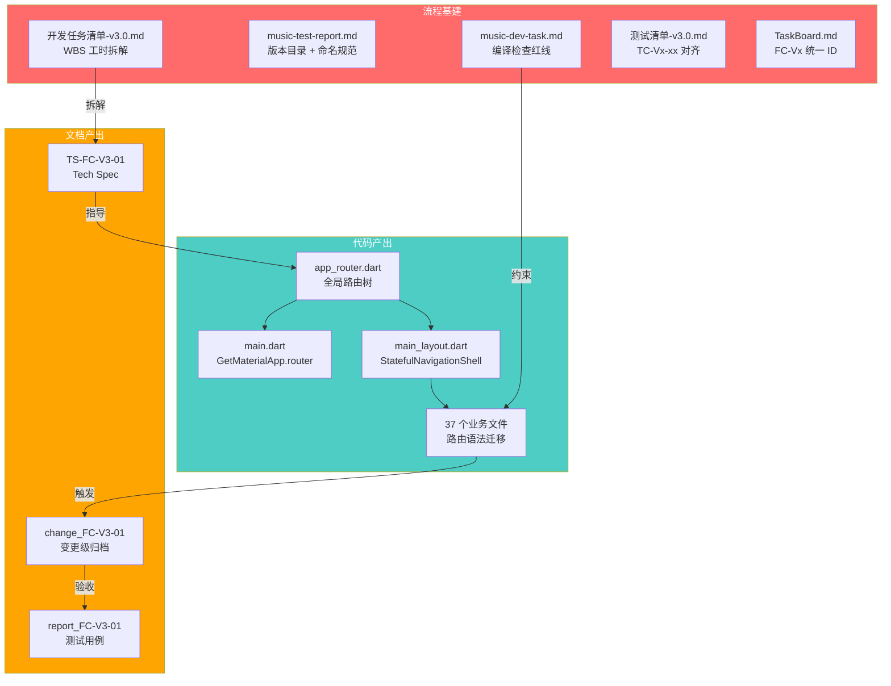

# v3.0 开发首日复盘：一个人做也优雅

> 当一个独立开发者决定不再给自己的草台班子找借口，会发生什么？

---

# 一、背景：为什么要写这篇复盘

## 1.1 今天做了什么

2026-05-02，v3.0 的第一个工作日。原计划只是执行 FC-V3-01（导航架构重构），但在实际推进过程中，我们发现 **AI 协作的基础设施本身就是不稳固的**——命名混乱、任务粒度粗放、编译检查缺失、文档目录无版本隔离。于是这一天变成了 **「一半修路，一半造车」** 的双线作战。

## 1.2 为什么值得复盘

这不是一篇纯技术复盘。上一篇《导航路由复盘》聚焦的是 **「为什么代码写错了」**，而这篇要回答的是 **「为什么流程会失控」**。

作为唯一的技术负责人，我在年初启动这个项目时几乎没有建立任何开发规范。结果就是：v1.0 上线后，迭代维护成本高得离谱，AI 每次换一个会话都像失忆了一样从零开始。今天的复盘，是对这种「技术债放任」的一次正式清算。

---

# 二、技术产出：FC-V3-01 导航架构重构

## 2.1 做了什么

将全站路由引擎从 GetX Routing 迁移至 `go_router`，彻底消除了困扰项目数月的浏览器 History 栈死锁问题。

| 改造项 | 具体动作 |
|--------|---------|
| 路由引擎替换 | 引入 `go_router`，配置 `StatefulShellRoute.indexedStack` 适配底部导航栏 |
| 根布局重构 | `MainLayout` 移除自研的 `NavigationController`，接入 `StatefulNavigationShell` |
| 全站语法迁移 | 编写 Python 脚本自动替换 37 个文件中的 `Get.toNamed` → `appRouter.push` |
| 上下文兜底 | 将 `go_router` 的 `navigatorKey` 绑定到 `Get.key`，修复 150+ 处弹窗失效 |

## 2.2 关键技术决策

**为什么不直接把 GetX 连根拔起？**

这是今天最重要的一个 Trade-off。方案评审时我们明确了「非目标」：**只剥离 GetX 的路由功能，保留其状态管理和依赖注入**。原因有三：

1. **爆炸半径控制**：全站有上百处 `.obs`、`Get.put()`、`Obx()`，如果同时替换状态管理，这将变成一次不可控的「推倒重来」。
2. **验证成本**：路由迁移的正确性可以通过 URL 和页面跳转直接验证；状态管理的替换则需要逐个业务场景回归，工期不可预测。
3. **技术独立性**：`go_router` 负责「去哪里」，GetX 负责「页面里的数据怎么变」，两者职责正交，共存没有冲突。

## 2.3 踩过的坑

| 问题 | 根因 | 修复方式 |
|------|------|---------|
| `flutter analyze` 报 5 个 URI 不存在 | Python 脚本中 import 路径是猜的，实际目录结构不同 | 逐一核实真实路径并修正 |
| `appRouter.pop(closeOverlays: true)` 编译失败 | `go_router` 的 `pop()` 不支持 `closeOverlays` 参数 | 移除该参数 |
| 点击「赞助支持」弹窗不显示 | `GetMaterialApp.router` 将路由控制权交给 `go_router` 后，GetX 内部的全局 `NavigatorKey` 被旁路 | 将 `go_router` 的 `navigatorKey` 设为 `Get.key`，一行代码修复 150+ 处弹窗 |

---

# 三、流程产出：AI 协作基础设施升级

这一部分才是今天真正的「主菜」。技术重构只是 **一次性的**，但流程的改进是 **永久性的**。

## 3.1 问题：编码完成后的静默放行

**发生了什么**：AI 完成了 37 个文件的批量重构后，直接就开始写 Changelog、更新看板、宣布任务完成。用户追问「有没有检查过编译报错？」——发现有 6 个编译错误被完全漏掉了。

**根因**：原来的 `music-dev-task` 工作流中，「自验证」步骤只是一个建议性的描述（"如条件允许，执行 flutter build web"），没有强制约束力。AI 把它当成了可选步骤。

**改进方案**：

将工作流的第 8 步从「自验证」升级为 **「强制编译与静态检查 (强制红线)」**：
- 代码编写完成后，**必须主动调用 `flutter analyze`**。
- 必须检索日志中的 `error` 关键字，修复至 **0 error** 状态。
- **绝对禁止**在存在编译报错的情况下生成 Changelog 或更新看板。

> 📍 变更文件：`.agent/workflows/music-dev-task.md` 第 112-115 行

## 3.2 问题：任务 ID 的无序增长

**发生了什么**：v3.0 的开发清单中，任务编号是 T28、T19、T20、T21、T22——完全没有规律，跨版本追溯时根本无法判断一个 ID 属于哪个版本的哪个模块。测试清单也是类似的混乱。

**根因**：这些 ID 是从 v1.0 的 18 个任务开始累加的流水号，没有任何语义结构。当项目进入多版本并行迭代阶段后，这种扁平编号就彻底失效了。

**改进方案**：

引入 **`FC-Vx-xx-xx` 三级层次化命名法**：

```
FC-V3-01-04
│   │  │  │
│   │  │  └── 子任务序号 (第 4 个子任务)
│   │  └───── 模块序号 (第 1 个功能模块)
│   └──────── 版本号 (v3.0)
└──────────── 前缀 (Feature Component)
```

| 旧 ID | 新 ID | 含义 |
|-------|-------|------|
| T28 | FC-V3-01 | v3.0 第 1 个模块：导航架构重构 |
| T19 | FC-V3-02 | v3.0 第 2 个模块：资源管道化处理 |
| T20 & T21 | FC-V3-03 | v3.0 第 3 个模块：数据流重构 |

测试用例同步对齐：`TC-V3-01-01` 表示「v3.0 第 1 模块的第 1 条测试用例」。

> 📍 变更文件：`docs/dev/开发任务清单-v3.0.md`、`docs/test/测试清单-v3.0.md`、`docs/TaskBoard.md`

## 3.3 问题：任务拆分粒度过粗

**发生了什么**：原来的开发清单中，「导航架构深度重构」只有 4 个子项，其中 3 个是模糊的大块描述（如「代码改造：重构 NavigationController，解耦 GetX 路由与 Browser History」）。这种粒度放在任何一家正规公司，都无法用来评估工时或分配任务。

**根因**：清单是从 PRD 的验收标准直接抄过来的，没有经过工程视角的 WBS（工作分解结构）拆解。

**改进方案**：

按照 **「超过 3 天必须拆细，每条附带明确交付物和工时预估」** 的原则，将每个模块拆成 4~6 个原子化子任务。例如 FC-V3-01 被拆成了：

| 子任务 | 交付物 | 工时预估 |
|--------|--------|---------|
| FC-V3-01-01 方案评审 | Tech Spec 文档归档 | 0.5 天 |
| FC-V3-01-02 基础库替换 | `app_router.dart` 静态路由表 | 0.5 天 |
| FC-V3-01-03 根布局改造 | `MainLayout` 接入 `StatefulNavigationShell` | 0.5 天 |
| FC-V3-01-04 全局平替手术 | 37 个文件的路由语法迁移 | 1 天 |
| FC-V3-01-05 上下文兜底修复 | `Get.key` 绑定修复弹窗 | 0.5 天 |
| FC-V3-01-06 逻辑验证 | 5 条回归测试用例通过 | 0.5 天 |

> 📍 变更文件：`docs/dev/开发任务清单-v3.0.md`

## 3.4 问题：测试报告目录的版本混杂

**发生了什么**：`docs/test_reports/` 目录下混杂着 v1.0 的回归报告、v2.0 的 T27 系列报告和 v3.0 的新报告，全部堆在一起，没有任何版本隔离。

**改进方案**：

创建版本化子目录，并迁移已有文件：

```
docs/test_reports/
├── v1.0/
│   └── v1.0_回归测试报告.md
├── v2.0/
│   ├── T27-R1_文章详情页_测试报告.md
│   ├── T27-R2_文章编辑器_测试报告.md
│   └── ... (5 份)
├── v3.0/
│   └── report_FC-V3-01_navigation_refactor.md
└── media/
```

同步更新了 `music-test-report` 工作流，强制要求后续报告写入 `docs/test_reports/[版本号]/` 路径。

> 📍 变更文件：`.agent/workflows/music-test-report.md`

---

# 四、今日变更资产全景

下图展示了今天所有产出物之间的关系。每一个节点都是一份已经写入磁盘的真实文件。



上图展示了三类产出物的流转关系：Tech Spec 指导代码实现，代码完成后触发变更归档，归档再驱动测试验收。而流程基建（红色）像护栏一样约束着每一步的执行质量。

---

# 五、总结

## 5.1 核心反思

| 反思点 | 教训 |
|-------|------|
| **流程不是大公司的专利** | 一个人开发更需要流程，因为没有同事帮你兜底，任何遗漏都只能自己买单 |
| **AI 不会主动检查自己的错误** | 如果你不把「编译检查」写成强制红线，AI 就会心安理得地跳过它 |
| **命名是最便宜的架构** | `FC-V3-01-04` 比 `T28` 多了几个字符，却消除了所有跨版本追溯的歧义 |
| **粗粒度任务 = 不可估期** | 一个「重构导航架构」可以是 1 天也可以是 1 个月，只有拆到 0.5 天粒度才能被管理 |
| **抱怨不解决问题** | 发现 AI 漏检编译错误时，正确的做法不是批评它，而是把检查写进工作流，让错误不可能再发生 |

## 5.2 今日改进清单

| 序号 | 改进项 | 影响范围 | 状态 |
|------|--------|---------|------|
| 1 | 编译检查写入工作流红线 | 所有后续开发任务 | ✅ 已落地 |
| 2 | FC-Vx-xx 三级 ID 命名体系 | 开发清单 + 测试清单 + 看板 + 归档 | ✅ 已落地 |
| 3 | WBS 工时拆解（每条 ≤ 0.5~1 天） | 开发清单 | ✅ 已落地 |
| 4 | 测试报告版本化目录 | test_reports/ | ✅ 已落地 |
| 5 | 测试报告命名规范 | music-test-report 工作流 | ✅ 已落地 |

## 5.3 下一步

1. **FC-V3-01 回归验收**：执行 5 条测试用例（TC-V3-01-01 ~ 05），确认导航重构无遗留问题。
2. **FC-V3-02 方案评审**：启动资源管道化处理的 Tech Spec 评审。
3. **代码规范巡检**：对照 AGENTS.md 的约束，系统性清理现有代码中不符合规范的部分。

---

> **「一个人做也优雅」不是一句口号，而是一套可执行、可验证、可持续改进的工程实践。**
