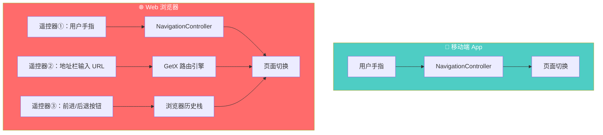
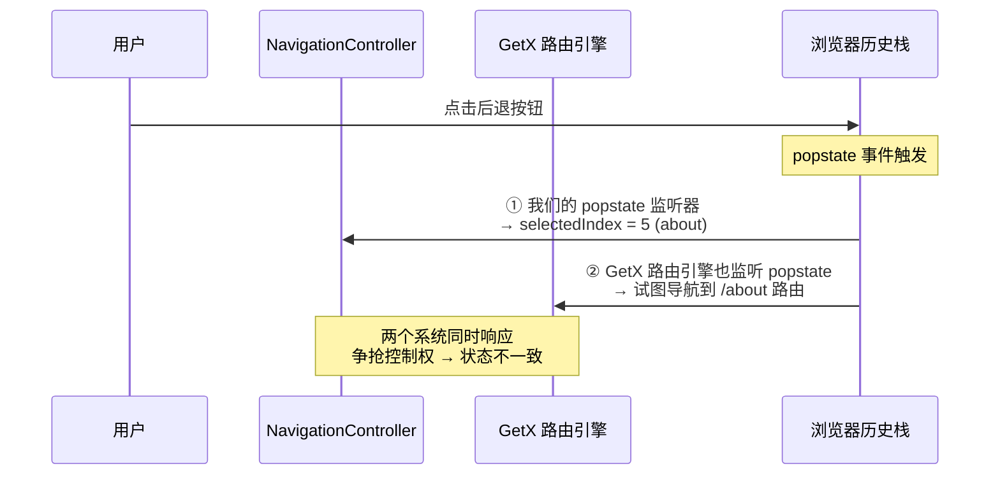
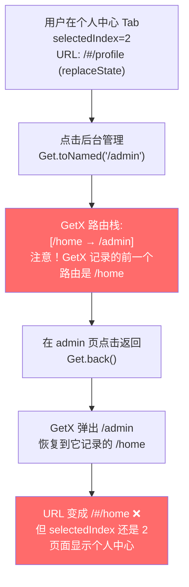
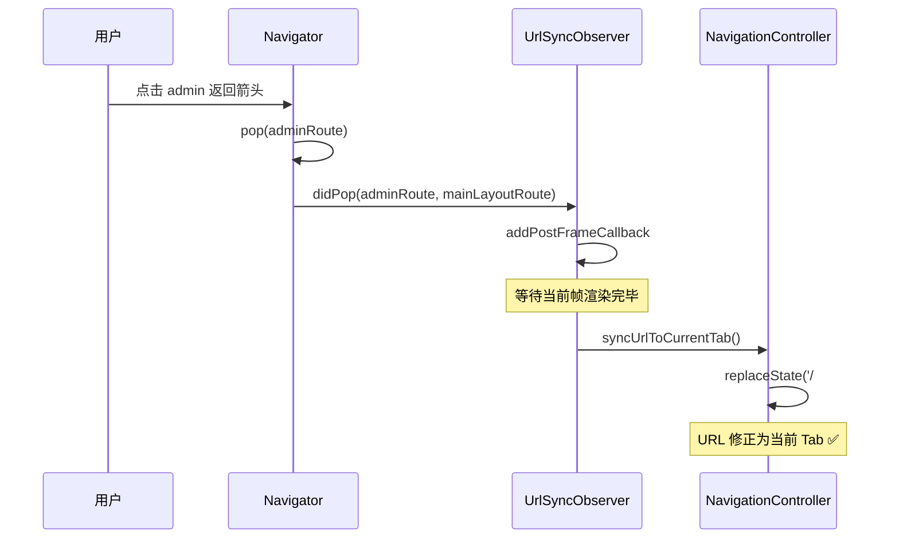
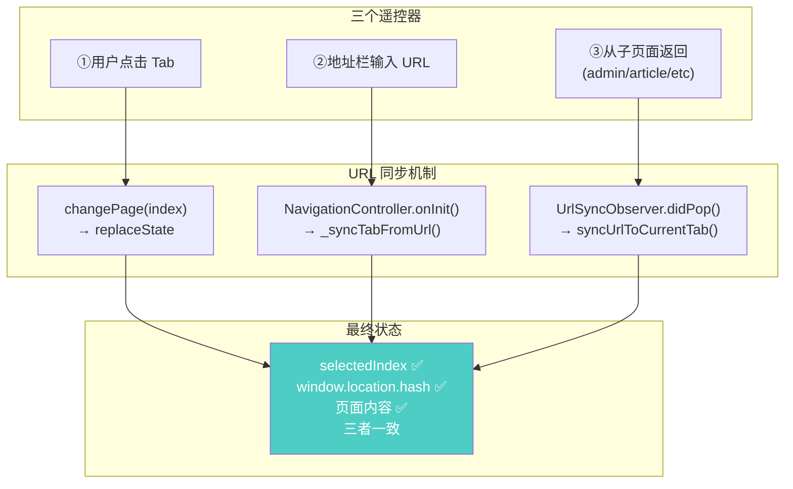
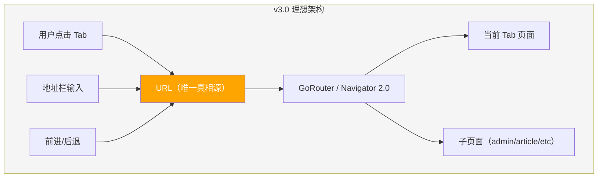

# 导航路由复盘：当移动端思维撞上浏览器的三个遥控器

> 为什么一个"点击 Tab 切换页面"的简单功能，反复修了四轮才稳定？问题不在代码，在认知。

---

# 一、背景：一个看似简单的 BUG

## 1.1 问题描述

v1.0 上线后回归测试发现：**所有 Tab 切换后浏览器 URL 始终停留在 `/#/home`**。

- 点击侧栏「心事角落」→ 页面切换了，URL 不变
- 点击侧栏「搜索发现」→ 页面切换了，URL 不变
- 主页「广场」↔「专栏」切换 → URL 不变
- 浏览器前进/后退按钮 → 完全无反应
- 把 URL 分享给朋友 → 对方打开的永远是首页

看起来只是"URL 没更新"，修一修就好了？事实证明，这个 BUG 从首次发现到最终稳定，经历了**四轮修复**。

## 1.2 为什么它值得写一篇复盘？

因为这不是一个孤立的 BUG，而是一个**架构设计问题的症状**。反复修的过程暴露了我们在 Flutter Web 路由体系上的**认知盲区**。如果不做复盘，v3.0 重构时大概率会踩同样的坑。

## 1.3 修复时间线

| 轮次 | 方案 | 结果 |
|------|------|------|
| 第 1 轮 | `pushState` 推入浏览器历史 + `popstate` 监听前进后退 | ❌ Tab 和 URL 多次切换后不一致 |
| 第 2 轮 | `pushState` → `replaceState`，移除 popstate 监听 | ✅ Tab 切换正常，但从 admin 返回后 URL 不对 |
| 第 3 轮 | 在 `MainLayout.build()` 加 `addPostFrameCallback` 同步 URL | ❌ 从 admin 返回时 `build()` 不被调用，无效 |
| 第 4 轮 | 添加 `UrlSyncObserver`（NavigatorObserver），在 `didPop` 时同步 URL | ✅ 彻底修复 |

**四轮才修好一个"URL 不更新"的 BUG** —— 这本身就说明了架构存在根本性问题。

---

# 二、根因分析：移动端有一个遥控器，Web 有三个

## 2.1 移动端 vs Web 的导航模型差异

这是整篇复盘的**核心认知**。

下图展示了移动端 App 和 Web 浏览器在导航控制权上的根本差异：



**移动端只有一个遥控器**（用户的手指），`NavigationController` 是唯一的导航决策者。

**Web 有三个遥控器**，而且三个遥控器的指令可能互相矛盾：
- 用户点击 Tab → `NavigationController` 说"去 profile"
- GetX 路由引擎看到 URL 是 `/home` → "应该在 home"
- 浏览器历史栈记录的是上一次 pushState 的 URL → "应该回到 diary"

**三个主人同时指挥一个仆人，仆人不知道听谁的。**

## 2.2 我们原始架构的致命假设

原始的 `NavigationController` 只有 5 行代码：

```dart
// ❌ 原始设计：完全的移动端思维
class NavigationController extends GetxController {
  final RxInt selectedIndex = 0.obs;

  void changePage(int index) {
    selectedIndex.value = index;
  }
}
```

这段代码隐含了一个致命假设：**"页面状态 = 内存中的一个整数"**。

在移动端，这完全正确。但在 Web 上，页面状态至少存在于**三个地方**：

| 状态存储位置 | 谁控制 | 同步方式 |
|------------|--------|---------|
| `selectedIndex` （Dart 内存） | NavigationController | `changePage()` |
| `window.location.hash` （浏览器地址栏） | 浏览器 + GetX 路由引擎 | 需要手动同步 |
| 浏览器历史栈 | 浏览器 | `pushState` / `replaceState` |

原始架构只管了第一个，完全忽略了后两个。这就是 URL 不更新的直接原因。

---

# 三、四轮修复的前因后果

## 3.1 第 1 轮：pushState + popstate —— 看似完美，实则两虎相争

**方案**：在 `changePage()` 中调用 `window.history.pushState()` 将 Tab 对应的 URL 推入浏览器历史栈，并监听 `popstate` 事件处理前进/后退。

```dart
// 第 1 轮方案
void changePage(int index) {
  if (selectedIndex.value == index) return;
  selectedIndex.value = index;
  html.window.history.pushState(null, '', '/#$path');
}

void _listenToBrowserNavigation() {
  html.window.onPopState.listen((_) => _syncTabFromUrl());
}
```

**问题**：多次切换 Tab 后点浏览器后退，URL 显示 `/#/about` 但页面内容是「个人中心」。

**根因**：



上图展示了 popstate 事件被两个系统同时捕获的竞争条件。我们的监听器和 GetX 的路由引擎各自独立处理同一个事件，导致最终状态取决于执行顺序，产生不确定性结果。

**教训**：`pushState` 会创建浏览器历史条目，而 Flutter Web 的 `HashUrlStrategy` 也在监听 `popstate`。两个系统同时响应同一个事件 = 灾难。

## 3.2 第 2 轮：replaceState —— 停止争抢，各管各的

**方案**：将 `pushState` 改为 `replaceState`，只更新地址栏显示，不创建浏览器历史条目。同时移除 `popstate` 监听器。

```dart
// 第 2 轮方案
void _replaceUrlForTab(int index) {
  final path = tabRoutes[index] ?? '/home';
  // replaceState 只改地址栏，不创建历史条目
  html.window.history.replaceState(null, '', '/#$path');
}
```

**效果**：Tab 切换时 URL 正确更新，浏览器后退/前进不再在 Tab 间循环（回到的是上一个真实页面，如文章详情），**这是 Gmail / YouTube 的标准行为**。

**新问题**：从「个人中心」进入「后台管理」，点返回箭头，URL 变成了 `/#/home` 而不是 `/#/profile`。

**根因**：



上图展示了 `replaceState` 和 GetX 路由栈的脱节。`replaceState` 只能改浏览器地址栏的"门牌号"，但 GetX 内部维护着自己独立的路由栈，两者互不知情。

**关键发现**：`replaceState` 只改了浏览器地址栏的"门牌号"，但 **GetX 内部的路由栈还记着原始的 `/home`**。当 `Get.back()` 从 admin 返回时，GetX 恢复的是**它自己记录的路由**，不是我们 `replaceState` 改过的。

## 3.3 第 3 轮：addPostFrameCallback —— 思路对了，但时机不对

**方案**：在 `MainLayout.build()` 中添加 `addPostFrameCallback`，每次渲染后同步 URL。

```dart
// 第 3 轮方案
@override
Widget build(BuildContext context) {
  WidgetsBinding.instance.addPostFrameCallback((_) {
    navCtrl.syncUrlToCurrentTab();
  });
  return LayoutBuilder(...);
}
```

**问题**：完全无效。从 admin 返回后 URL 依然是 `/#/home`。

**根因**：Flutter 的 `Navigator` 是**覆盖式**的。当 admin 页面弹出时，下面的 MainLayout 只是"重新露出来"了，**`build()` 根本不会被调用**，因为 Widget 树没有任何变化。

```
Navigator 栈:
┌──────────────────────┐
│    Admin Page         │  ← pop 后移除
├──────────────────────┤
│    MainLayout         │  ← 一直在这里，没有重建
└──────────────────────┘
```

**教训**：StatelessWidget 的 `build()` 不等于"页面可见时回调"。在 Flutter 中，"页面重新可见"和"Widget 重建"是两个完全不同的概念。

## 3.4 第 4 轮：NavigatorObserver —— 用对的工具做对的事

**方案**：添加 `UrlSyncObserver`（继承 `NavigatorObserver`），在任何页面被 pop 时自动同步 URL。

```dart
// ✅ 第 4 轮最终方案
class UrlSyncObserver extends NavigatorObserver {
  @override
  void didPop(Route route, Route? previousRoute) {
    super.didPop(route, previousRoute);
    WidgetsBinding.instance.addPostFrameCallback((_) {
      if (Get.isRegistered<NavigationController>()) {
        Get.find<NavigationController>().syncUrlToCurrentTab();
      }
    });
  }
}
```

注册到 `GetMaterialApp.navigatorObservers` 中：

```dart
navigatorObservers: [
  SentryNavigatorObserver(),
  UrlSyncObserver(), // ← 从 admin/article 等页面返回时自动同步 URL
],
```

**为什么这次有效**：



上图展示了 `NavigatorObserver.didPop` 的执行时序。关键在于它是 Flutter 官方的路由生命周期 API，不依赖 Widget 重建，可靠地捕获任何 push/pop 事件。

`NavigatorObserver` 是 Flutter 框架级别的路由生命周期钩子。无论 Widget 是否重建，只要 Navigator 有路由变化（push、pop），Observer 就一定会被通知。这是**正确的抽象层级**。

---

# 四、完整的修复架构

经过四轮修复后，最终的导航 URL 同步架构如下：



上图展示了三个触发源分别由不同的同步机制处理，最终确保三个状态（内存索引、地址栏 URL、页面内容）始终一致。

### 变更文件汇总

| 文件 | 核心变更 |
|------|---------|
| `lib/features/layout/main_layout.dart` | NavigationController 增加 Tab↔URL 映射表 + `replaceState` 同步 + `syncUrlToCurrentTab()` |
| `lib/main.dart` | 6 个 Tab 路由注册到 getPages + 启动智能跳转 + `UrlSyncObserver` |
| `lib/features/home/home_view.dart` | 广场/专栏 Tab 改 `StatefulWidget` + 手动 `TabController` + URL 同步 |

---

# 五、为什么会走弯路？

## 5.1 认知盲区：不了解 Flutter Web 的路由机制

| 我们以为的 | 实际情况 |
|-----------|---------|
| `window.history.pushState` 只是改 URL | Flutter 的 `HashUrlStrategy` 也在监听 `popstate`，pushState 创建的历史条目会触发 GetX 路由 |
| `replaceState` 会同步 GetX 的路由栈 | `replaceState` 只改浏览器地址栏，GetX 内部维护独立的路由栈，两者互不知情 |
| Widget 的 `build()` 在页面可见时会调用 | Navigator pop 时 Widget 只是"重新露出来"，不触发 `build()` |
| NavigationController 是导航的唯一决策者 | Web 上有三个导航源（用户点击 + 地址栏 + 浏览器按钮），任何一个都可能改变状态 |

## 5.2 设计缺陷：main_layout.dart 是"上帝 Widget"

```
main_layout.dart (490+ 行，远超 300 行红线)
├── NavigationController — 导航状态管理
├── 侧栏 UI — 大屏专用
├── 底栏 UI — 小屏专用
├── IndexedStack — 页面切换
├── 消息红点 — 实时计数
├── 管理员入口 — 权限判断
├── 播放器栏 — 音乐播放
├── 登录/登出 — 认证流程
└── 赞助弹窗 — 业务逻辑
```

**一个文件干了 9 件事**，任何一处改动都可能牵连其他部分。这就是为什么"修了 URL 又坏了前进后退"、"加了 Observer 又要注意重复 import"。

## 5.3 根本原因：移动端思维直接搬到 Web

作为 App 开发出身的开发者，最自然的思维是：

> "页面切换 = 改一个 index 变量 = 完事"

这在 iOS/Android 上 100% 正确。但 Web 浏览器是一个有**自己意志的宿主环境** —— 它有地址栏、有前进后退键、有历史栈，用户可以绕过你的 UI 直接操纵这些。

这不是代码水平的问题，而是**平台认知**的问题。

---

# 六、技术债与后续规划

## 6.1 当前方案的局限性

当前的 `replaceState + UrlSyncObserver` 方案是**打补丁式修复**，面对当前的需求够用，但存在以下局限：

| 局限 | 影响 |
|------|------|
| Tab 切换不创建浏览器历史条目 | 浏览器后退/前进不能在 Tab 间切换（回到上一个真实页面） |
| `replaceState` 和 GetX 路由栈始终不同步 | 每次从子页面返回都需要 Observer 修正 |
| NavigationController 和 GetX 路由是两套独立系统 | 任何新的导航场景都可能暴露新的不一致 |

## 6.2 已记录的技术债（T28）

已在 TaskBoard 和开发任务清单中记录，计划 v3.0 执行：

| 子任务 | 内容 |
|--------|------|
| T28-1 | 拆分 main_layout.dart 为独立文件 |
| T28-2 | 评估 Navigator 2.0 / GoRouter 替代 GetX Hash 路由 |
| T28-3 | 统一导航状态源：URL 驱动 Tab 状态（单一真相源） |
| T28-4 | 侧栏/底栏改用 GetX 命名路由 + 嵌套 Navigator 保持页面状态 |
| T28-5 | 全场景回归测试 |

## 6.3 理想的目标架构



上图展示了 v3.0 重构的目标：让 URL 成为唯一的导航状态源（Single Source of Truth），所有导航操作（点击、输入 URL、前进后退）都通过 URL 驱动，消除多系统竞争。

**核心原则**：URL 是唯一的导航状态源。所有导航操作最终都转化为 URL 变更 → 路由系统解析 URL → 渲染对应页面。不再有"内存里一个 index、地址栏一个 URL、GetX 一个路由栈"的三方割裂。

---

# 七、总结

## 7.1 核心反思

| 反思点 | 教训 |
|-------|------|
| **平台决定架构** | 移动端的导航模式不能直接搬到 Web 上，浏览器有自己的导航系统（地址栏 + 历史栈 + 前进后退），必须主动适配 |
| **不要有两个主人** | 一个系统中不能同时有 GetX 路由引擎和 Browser History API 两套导航系统独立运作，必须明确谁是"唯一主人" |
| **理解框架的监听机制** | `pushState` 不只是"改 URL"，Flutter Web 的 `HashUrlStrategy` 也在监听 popstate，一个 pushState 可能触发意料之外的导航 |
| **Widget 生命周期 ≠ 页面可见性** | `build()` 不是"页面重新可见"的回调，需要用 `NavigatorObserver` 或 `RouteAware` 等专用 API |
| **打补丁的极限** | 四轮修复说明架构已到了补丁能力的极限，需要在合适的时机做一次根本性的重构 |

## 7.2 组件对照表

| 组件 | 职责 | 文件位置 |
|------|------|---------|
| `NavigationController` | 管理 Tab 索引 + replaceState 同步 URL | `lib/features/layout/main_layout.dart` |
| `NavigationController.tabRoutes` | Tab 索引 → URL 路径映射表 | 同上 |
| `NavigationController.syncUrlToCurrentTab()` | 确保地址栏 URL 与当前 Tab 一致 | 同上 |
| `UrlSyncObserver` | NavigatorObserver，页面 pop 时自动调用 syncUrlToCurrentTab | `lib/main.dart` |
| `ContentTabView._onTabChanged()` | 广场/专栏 Tab 切换时 replaceState 同步 URL | `lib/features/home/home_view.dart` |
| `_checkAuthAndRedirect()` | 启动时读取 URL hash，智能跳转到对应路由 | `lib/main.dart` |

## 7.3 注意事项

- 当前方案使用 `replaceState` 而非 `pushState`，Tab 切换不会创建浏览器历史条目。这意味着浏览器后退按钮回到的是上一个真实页面（如文章详情），不会在 Tab 间循环。这是**有意的设计选择**，与 Gmail、YouTube 等大厂 Web 应用行为一致
- 如果新增 Tab 页面，需要同步更新 `NavigationController.tabRoutes` 映射表和 `main.dart` 的 `getPages` 路由注册
- `UrlSyncObserver` 的 `didPop` 会在**任何**页面 pop 时触发（包括 dialog、bottomSheet 等），但由于只是调用 `replaceState` 设置已有值，多余的调用完全无害
- 当前的 `main_layout.dart` 已超过 490 行，严重违反 300 行红线。T28 重构时请优先拆分此文件
