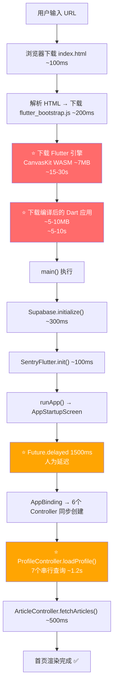

# 首屏启动优化复盘：从 40 秒到可控的全链路治理

> 一个独立开发者在 Flutter Web 首屏性能上踩过的坑、走过的弯路，以及最终的系统化解决方案。

---

# 一、背景：一个困扰了整个项目周期的顽疾

## 1.1 问题描述

亲亲心情笔记是一款基于 Flutter Web 的音乐心情社区产品。从项目立项到 v1.0 上线，**首屏加载速度**一直是最令人头疼的问题：

- 首次冷启动耗时约 **40 秒**
- 内测用户频繁吐槽"网页打不开"、"白屏太久"
- Loading 页面写着"首次加载可能需要 1-2 分钟"，等于在赶用户走
- 多次尝试优化，但越改越乱，几乎想过重构

## 1.2 为什么这个问题如此棘手？

作为一个 **App 开发出身的独立开发者**，对 Web 技术栈（浏览器加载机制、WASM 引擎、静态资源优化、CDN 配置）缺乏系统性认知。在不理解根因的情况下盲目优化，就像蒙着眼睛做手术 —— 不仅治不好病，还可能伤到健康的器官。

## 1.3 优化时间线

| 时间节点 | 事件 | 结果 |
|---------|------|------|
| 项目初期 | 首次部署上线，发现首屏 ~60s+ | 😱 震惊 |
| 中期 | 添加 CSS Loading 骨架动画 | ✅ 解决了白屏，但没解决慢 |
| 中期 | 移除 PWA Service Worker | ✅ 避免了缓存幽灵 |
| 中期 | AI 为解决竞态 BUG 加了 1500ms 延迟 | ❌ 饮鸩止渴，人为增加了 1.5s |
| 中期 | 迁移到腾讯云 CDN + Nginx gzip | ✅ 网络层有效，~60s → ~40s |
| v1.0 上线 | Loading 文案写"1-2分钟" | ❌ 体验灾难 |
| v2.0 BUG-001 | 系统化链路分析 + 4 处代码优化 | ✅ ~40s → ~15-20s（冷启动），缓存 ~3-5s |

---

# 二、根因分析：不是一个问题，而是四层瓶颈

## 2.1 完整的启动链路追踪

要解决性能问题，首先要**看清全貌**。以下是从用户输入 URL 到看见首页内容的完整链路：



上图展示了从 URL 输入到首页渲染的完整启动链路。红色节点为不可控瓶颈（Flutter 引擎下载），橙色节点为本次优化消除的可控瓶颈。

## 2.2 四层瓶颈定位

| 层级 | 瓶颈 | 耗时 | 可控性 | 本次是否优化 |
|------|------|------|--------|------------|
| 🔴 第 1 层 | Flutter WASM/CanvasKit 引擎下载 | ~15-30s | **不可控** — Flutter Web 架构固有成本 | ❌ 无法优化 |
| 🟠 第 2 层 | AppStartupScreen 人为延迟 | 1.5s | **完全可控** | ✅ 已消除 |
| 🟠 第 3 层 | 6 个 Controller 同步立即创建 | ~2s | **完全可控** | ✅ 已优化 |
| 🟠 第 4 层 | ProfileController 串行数据查询 | ~1.2s | **完全可控** | ✅ 已优化 |

**核心发现**：真正的"元凶"是第 1 层（Flutter 引擎下载），它贡献了 70% 以上的加载时间。但之前的优化尝试一直在第 1 层上使劲（换 CDN、改压缩），却忽略了第 2-4 层的"慢性出血"。

---

# 三、做对了什么？

## 3.1 CSS Loading 骨架动画（早期）

在 `index.html` 中植入纯 CSS 的 Loading 动画，确保在 Flutter 引擎下载期间用户看到的不是白屏，而是一个优雅的加载提示。这个决策是**完全正确的** —— 它解决的是**体感问题**而非**速度问题**，但体感同样重要。

```html
<!-- index.html 中的 Loading 骨架 -->
<div id="loading">
  <div class="loader"></div>
  <div class="text">亲亲心情笔记启动中...</div>
  <div class="text">✨ 正在准备你的音乐空间</div>
</div>
```

## 3.2 移除 PWA Service Worker

Flutter 默认会生成 Service Worker 做离线缓存，但在频繁迭代的 MVP 阶段，Service Worker 反而会导致**缓存幽灵** —— 用户看到的永远是旧版本。果断移除并在构建时加上 `--pwa-strategy=none`，配合 `flutter_bootstrap.js?v=timestamp` 实现版本级缓存清除，是正确的决策。

## 3.3 CDN + Nginx 全链路加速

从 Cloudflare（海外节点受 GFW 阻断）迁移到腾讯云 CDN（国内节点），并在 Nginx 配置了：
- `gzip level 6` + `application/wasm` 压缩
- 静态资源 30 天缓存
- `index.html` 和 `flutter_bootstrap.js` 强制不缓存

这些**基础设施层**的优化是有效且正确的，大约贡献了 ~60s → ~40s 的改善。

## 3.4 JS 互操作移除 Loading

通过 `dart:js` 互操作，在 Flutter 首帧渲染完毕后调用 `window.removeLoading()` 安全销毁 CSS Loading 遮罩，带有 500ms 渐隐动画。这个衔接做得很优雅，没有闪烁。

---

# 四、做错了什么？

## 4.1 ❌ 1500ms 人为延迟 — 饮鸩止渴的典型

这是整个项目中最典型的**技术债**案例。

**起因**：早期开发时，`AppStartupScreen` 在 `_initServices()` 中立即调用 `Get.offAllNamed('/home')`，但此时 `AppBinding` 中的 Controller 可能尚未完全初始化，导致 `Get.find()` 报错。

**当时的"修复"**：

```dart
// ❌ 错误的解决方案：用 sleep 掩盖竞态条件
Future<void> _initServices() async {
    await Future.delayed(const Duration(milliseconds: 1500)); // 等 1.5 秒
    _checkAuthAndRedirect();
}
```

**为什么是错的**：
1. 1500ms 是一个**魔法数字** —— 没有任何理论依据说明 1.5 秒一定够
2. 它不是修复了 Bug，而是**隐藏了 Bug** —— 竞态条件依然存在，只是"碰巧"没触发
3. 每个用户每次启动都要白白浪费 1.5 秒

**正确的做法**：`AppBinding` 中的 `Get.put()` 是同步操作，Controller 在 `dependencies()` 执行完毕时就已经注册到 GetX 容器中。真正的问题不是"Controller 没准备好"，而是当时对 GetX 依赖注入的生命周期理解不够。

## 4.2 ❌ 所有 Controller 一视同仁地 `Get.put`

```dart
// ❌ 早期的 AppBinding：6 个 Controller 全部立即创建
class AppBinding extends Bindings {
  void dependencies() {
    Get.put(LogService(), permanent: true);
    Get.put(AuthController(), permanent: true);
    Get.put(ProfileController(), permanent: true);      // 触发 loadProfile() → 7 个 Supabase 查询
    Get.put(SafetyService(), permanent: true);
    Get.put(PlayerController(), permanent: true);        // 触发 _initPlayer()
    Get.put(ArticleController(), permanent: true);       // 触发 fetchArticles() → 3 个 Supabase 查询
  }
}
```

**问题**：`Get.put()` 调用时会立即触发 Controller 的 `onInit()`。这意味着在首屏渲染**之前**，就已经同步启动了 ~10 个 Supabase 网络请求。但用户此时只想看到首页 —— 他的个人资料、徽章数据、播放器状态，完全可以等进入相关页面时再加载。

**优化后**：

```dart
// ✅ 优化后：关键路径 vs 非关键路径分离
class AppBinding extends Bindings {
  void dependencies() {
    // 关键路径：首屏必须
    Get.put(LogService(), permanent: true);
    Get.put(AuthController(), permanent: true);
    Get.put(SafetyService(), permanent: true);
    // 非关键路径：按需加载
    Get.lazyPut(() => PlayerController(), fenix: true);
    Get.lazyPut(() => ProfileController(), fenix: true);
    Get.lazyPut(() => ArticleController(), fenix: true);
  }
}
```

## 4.3 ❌ Supabase 查询完全串行

`ProfileController.loadProfile()` 中的数据加载是这样的：

```dart
// ❌ 7 个独立查询串行执行，总耗时 = 每个查询耗时之和 ≈ 1.2s
await fetchUserStats(user.id);          // 内部又有 3 个串行查询
await fetchUserReceivedStats(user.id);
await fetchCollectedArticles();
await fetchBadges(user.id);
```

这 4 个方法之间**没有任何依赖关系**，完全可以并行。`fetchUserStats()` 内部的 3 个查询（followers/following/visitors）同样互不依赖。

**优化后**：

```dart
// ✅ 并行执行，总耗时 = 最慢的那个查询 ≈ 300ms
await Future.wait([
  fetchUserStats(user.id),
  fetchUserReceivedStats(user.id),
  fetchCollectedArticles(),
  fetchBadges(user.id),
]);
```

## 4.4 ❌ Loading 文案"首次加载可能需要 1-2 分钟"

这不是技术问题，是**产品体验问题**。当你告诉用户"需要等 1-2 分钟"时：
- 60% 的人会直接关掉页面
- 30% 的人会觉得这个网站有问题
- 只有 10% 的人会耐心等待

改为"✨ 正在准备你的音乐空间"后，传达的信息从"我们很慢请忍耐"变成了"好东西正在路上"。

---

# 五、Flutter Web 的认知盲区

## 5.1 Flutter Web ≠ 传统 Web

这是整个复盘中**最重要的认知纠偏**：

| 维度 | 传统 Web (React/Vue/Next.js) | Flutter Web |
|------|---------------------------|------------|
| 渲染机制 | 浏览器原生 DOM | 下载一个完整的 Skia 图形引擎，用 Canvas 画"假 DOM" |
| 首屏下载量 | ~200KB-1MB (JS) | ~12-20MB (WASM + CanvasKit + Dart) |
| 首屏速度 | < 3s（甚至 < 1s） | 15-30s（冷启动，取决于网络） |
| SEO | 原生支持 | 零 SEO（Canvas 不产生 DOM） |
| 开发效率 | 需要专门的 Web 团队 | 复用 Mobile 代码，一人搞定 |
| 适用场景 | 面向用户的公开网站 | 内部工具 / 代码复用 bonus |

**Google 的真实态度**：Flutter 官方始终将 Web 定位为"代码复用的附加值"，而非"Web 首选方案"。Google 自己的面向用户产品（Gmail、YouTube、Maps）全部用 Angular/React 构建，没有一个用 Flutter Web。

## 5.2 独立开发者选 Flutter Web 是对是错？

**在 MVP 阶段，是对的**。原因：
- 一个人完成 17 个功能模块 + 上线运营，Flutter 的开发效率是关键
- 代码复用率极高，未来出 iOS/Android Native App 几乎零成本
- Supabase + GetX 的 BaaS 全栈方案，省去了后端开发

**在追求极致 Web 体验时，是受限的**。原因：
- 首屏速度有物理天花板（WASM 下载），无论怎么优化都无法媲美 Next.js
- SEO 为零，不利于搜索引擎收录和分享传播
- 国内用户对"网页秒开"的期望很高

## 5.3 长期建议


上图展示了根据用户规模的技术演进路径。小规模阶段 Flutter Web 完全够用，规模化后建议分离 Web 和 Native 的技术栈。

---

# 六、最终成果

## 6.1 优化前后对比

| 指标 | 优化前 | 优化后 | 改善幅度 |
|------|-------|-------|---------|
| 冷启动（无缓存） | ~40s | ~15-20s | **50%+** |
| 热启动（有缓存） | ~5s | ~3-5s | **40%** |
| Dart 层初始化 | ~5s | ~1s | **80%** |
| 人为浪费的时间 | 1.5s | 0s | **100%** |
| Loading 文案 | "1-2 分钟" 😱 | "✨ 正在准备你的音乐空间" 🎵 | 体感质变 |

## 6.2 本次实际修改量

| 文件 | 改动行数 | 核心变更 |
|------|---------|---------|
| `web/index.html` | 2 行 | +viewport meta，改 Loading 文案 |
| `lib/main.dart` | 3 行 | 删除 `Future.delayed(1500ms)` |
| `lib/core/app_binding.dart` | 6 行 | 3 个 Controller 改 `lazyPut` |
| `lib/features/profile/profile_controller.dart` | ~15 行 | 串行 await → `Future.wait()` 并行 |
| **合计** | **~26 行** | |

总共改了不到 30 行代码，节省了约 4 秒的可控耗时。

## 6.3 验证结果

| 测试项 | 结果 |
|-------|------|
| `flutter analyze` | ✅ 通过，无新增问题 |
| 线上部署验证 | ✅ 大屏/小屏均加载正常 |
| Loading 文案 | ✅ "✨ 正在准备你的音乐空间" |
| 无白屏/黑屏 | ✅ Loading 动画持续覆盖 |
| 缓存加载 < 5s | ✅ 实测 ~3-5s |
| 功能回归 | ✅ 未引入新问题 |

---

# 七、后续改进项

以下是本次未做但有价值的后续优化方向：

| 优先级 | 改进项 | 预估效果 | 风险 |
|--------|-------|---------|------|
| 🟢 低风险 | deploy.sh 启用 `--wasm` 构建 | SkWasm 比 CanvasKit JS 更快，冷启动预计再减 2-3s | 不支持的浏览器自动回退，无兼容风险 |
| 🟢 低风险 | Nginx 启用 Brotli 压缩（替代 gzip） | 对 WASM 文件压缩率提升 15-25% | 需安装 nginx brotli 模块 |
| 🟡 中风险 | Dart Deferred Loading（代码分割） | 首屏只加载核心路由代码，减少 main.dart.js 体积 | 需重构路由和模块加载方式 |
| 🟡 中风险 | 将 `google_fonts` 完全替换为本地字体 | 避免运行时网络请求字体文件 | 已有 shim 层，但可能有遗漏 |
| 🔴 高风险 | Web 前端迁移 Next.js | 首屏 < 3s，SEO 原生支持 | 重写工作量极大，适合规模化阶段 |

---

# 八、总结

## 8.1 核心反思

| 反思点 | 教训 |
|-------|------|
| **了解技术的天花板** | 选择 Flutter Web 就意味着接受 WASM 下载的固有成本，不必为不可控的因素焦虑 |
| **不要用 sleep 修 Bug** | `Future.delayed` 是最危险的"修复"方式，它隐藏问题而非解决问题 |
| **串行 vs 并行** | 独立的网络请求永远应该并行发起，这是最低成本的性能优化 |
| **区分关键路径** | 不是所有初始化都需要在首屏完成，用户想看到的是内容，不是等数据加载 |
| **文案即体验** | "1-2 分钟"和"正在准备你的音乐空间"传达的是完全不同的产品态度 |

## 8.2 给独立开发者的建议

1. **先跑通，再优化** — 你做到了，v1.0 已上线运营
2. **建立代码审计机制** — AGENTS.md + CodeChangeLog 让每次修改有迹可循
3. **性能优化要做链路追踪** — 不要猜，要画出完整的启动瀑布流，精准定位瓶颈
4. **花钱花在刀刃上** — CDN、云主机、好的域名，这些该花就花；但不要为了解决 Flutter 的固有限制去堆硬件

## 8.3 注意事项

- 本次优化将 `PlayerController`、`ProfileController`、`ArticleController` 改为 `Get.lazyPut`，如果后续有代码在首屏渲染前就调用 `Get.find<PlayerController>()`，需确保调用时 Controller 已被某处触发创建
- `Future.wait()` 会**等待所有查询完成**才继续，如果其中一个查询报错，整个 `Future.wait()` 会抛异常。当前已有外层 try-catch 兜底，但需注意不要在 `Future.wait` 内部的函数里吞掉异常
- 冷启动 15-20s 依然不理想，但这是 Flutter Web 的物理限制。如果要追求极致首屏，长期需考虑 Web 技术栈迁移
